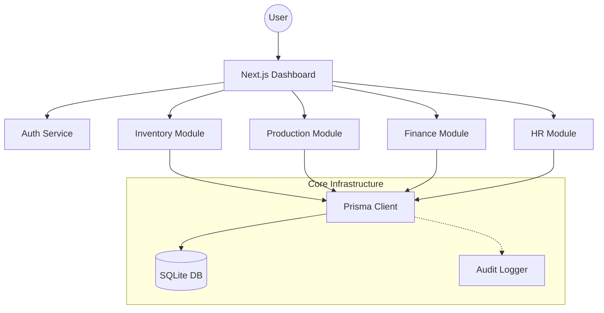
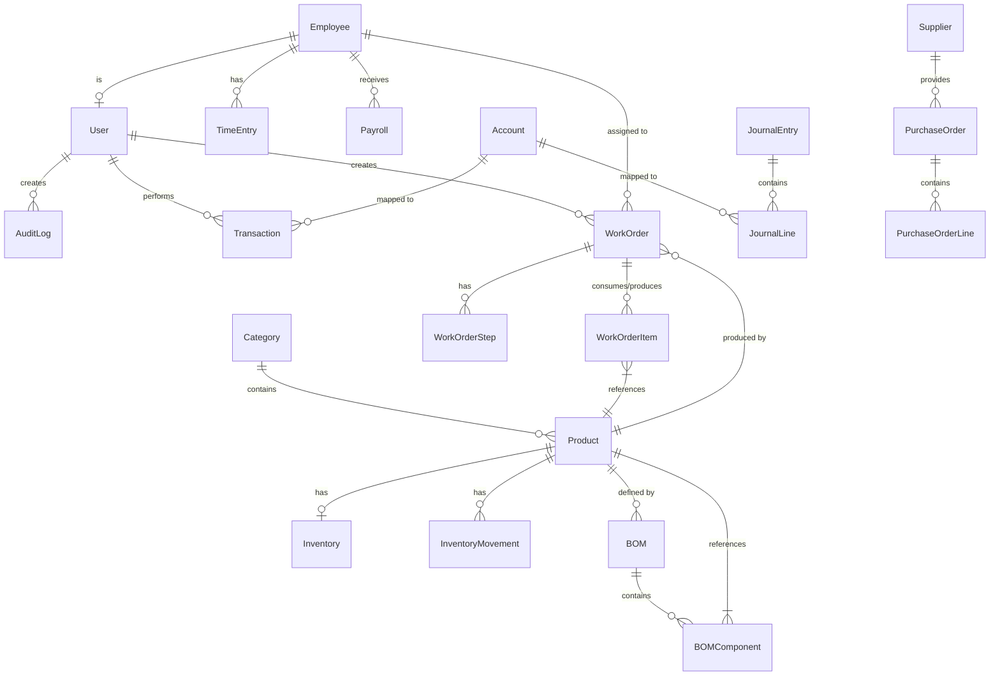
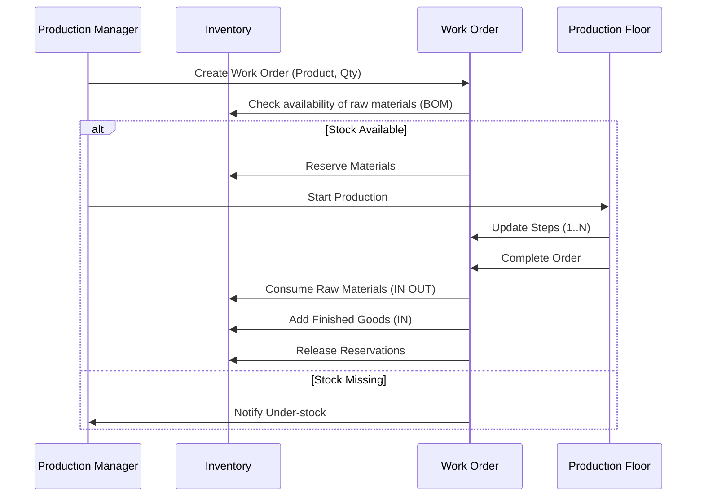
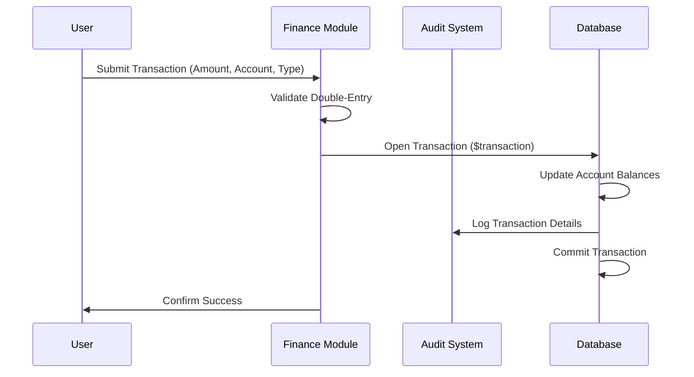

# Industrial ERP - Architecture & Workflows

##  System Architecture



---

##  Entity Relationship Diagram (ERD)



---

##  Core Workflows

### Production Lifecycle



### Financial Transaction & Audit Flow



---

##  Project Structure

```text
INDUSTRIALERP/
├── src/                # Core Application (Next.js)
│   ├── app/            # API Routes & Pages
│   ├── lib/            # Shared Utilities & Services
│   └── components/     # UI Design System
├── prisma/             # Database Schema & Migrations
├── public/             # Static Assets
└── package.json        # Dependencies & Scripts
```
